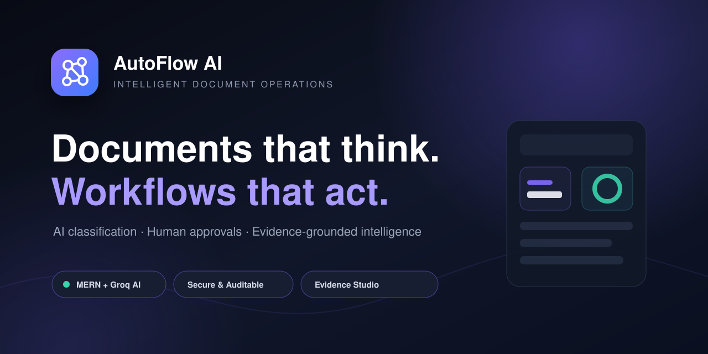
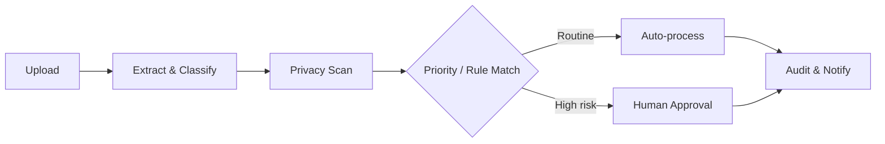
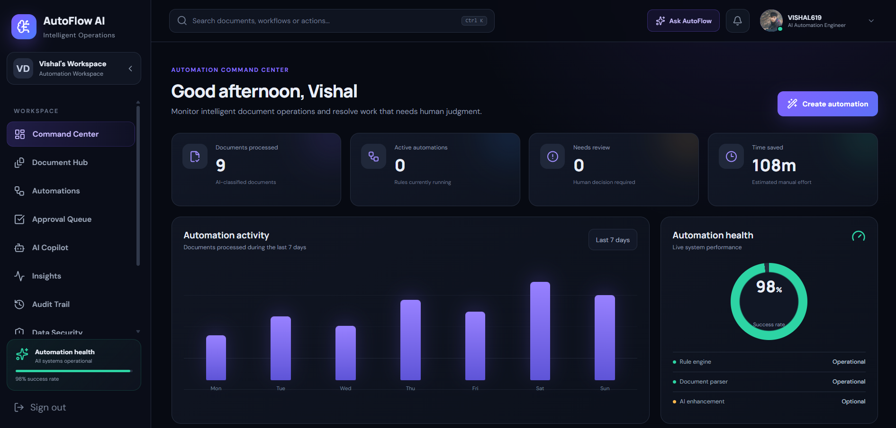
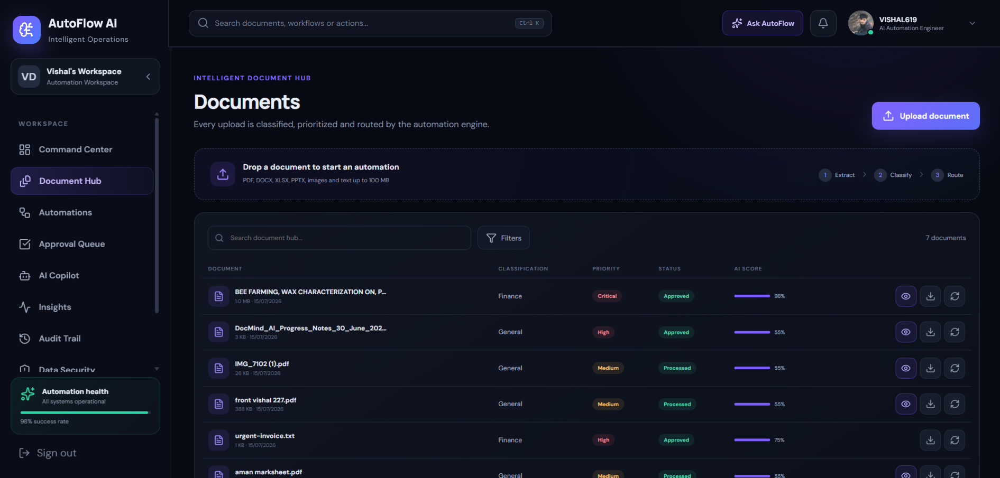
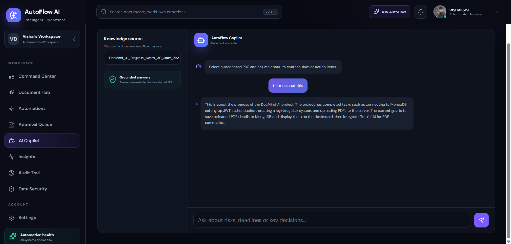
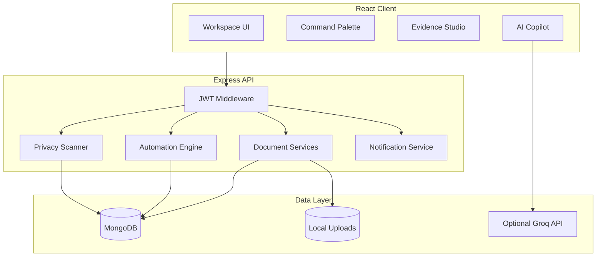

# AutoFlow AI

<p align="center">
  
</p>

<p align="center">
  <strong>AI-powered document workflow automation with evidence-grounded intelligence, human approvals and privacy-aware processing.</strong>
</p>
<p align="center">
  <a href="https://autoflow-ai-vishal.netlify.app">
    <strong>🚀 Open Live Demo</strong>
  </a>
  &nbsp;•&nbsp;
  <a href="https://autoflow-ai-api.onrender.com">API Status</a>
  &nbsp;•&nbsp;
  <a href="https://github.com/Vishal619-dubey/AutoFlow-AI">Source Code</a>
</p>
<p align="center">
  
  
  
  
  
</p>

## Overview

AutoFlow AI is a full-stack intelligent document operations platform. It transforms uploaded PDFs and business files into secure, auditable workflows by automatically extracting text, classifying content, detecting priority, finding action items, scanning sensitive data and routing important documents for human approval.

The platform combines a reliable local automation engine with optional Groq-powered language intelligence. Core document processing continues to work even when an external AI API is unavailable.

## Why AutoFlow AI?

Most document applications only upload, store and search files. AutoFlow AI treats every document as an operational event:



- Automation decisions are explainable and recorded.
- High-risk work remains under human control.
- PDF answers are grounded in uploaded document content.
- Sensitive identifiers are masked before being shown in security results.
- Every user can access only their own documents and workflow data.

## Key Features

### Intelligent Document Hub

- Upload PDF, TXT, DOCX, XLSX, PPTX and supported media files.
- Automatic text extraction for PDF and TXT documents.
- Local classification into Finance, Legal, Academic, HR, Operations or General.
- Priority detection, confidence scoring and action-item extraction.
- Secure view, verified download, soft delete, Trash, restore and permanent deletion.

### No-Code Automation Engine

- Trigger–condition–action workflow builder.
- Natural-language workflow generation with Groq and a local fallback parser.
- Automatic rule execution on upload, priority detection and approval completion.
- Enable, pause and delete rules.
- Persistent run counts and a complete Audit Trail.

### Human-in-the-Loop Approval

- High and critical priority documents can be paused for review.
- Approve or reject documents from a dedicated queue.
- Approval decisions can trigger downstream automation rules.
- Every decision remains isolated to the authenticated workspace.

### Evidence Studio

- Protected in-browser PDF viewer with fullscreen support.
- Secure original-file download.
- SHA-256 document fingerprint and integrity verification.
- Decision Radar for risks, deadlines, amounts and recommended actions.
- Clickable evidence items linked to source pages when page indexing is available.
- Integrated privacy findings and AI confidence.

### Grounded AI Copilot

- Select a processed PDF as the knowledge source.
- Ask questions about risks, deadlines, decisions and document content.
- Answers are restricted to the selected PDF.
- Page citations are generated when page markers are available.
- Clear refusal when information is absent from the document.

### Sensitive Data Scanner

- Detects email addresses, Indian phone numbers, Aadhaar, PAN and payment cards.
- Masks samples returned by the API.
- Calculates document-level privacy risk score and severity.
- Provides automatic scanning for new PDF/TXT uploads and manual rescanning.

### Executive Report Generator

- One-click A4 executive intelligence report.
- Includes summary, risks, deadlines, actions, privacy score and AI confidence.
- Embeds report ID, generated-by identity and SHA-256 fingerprint.
- Browser-native Print / Save as PDF workflow.

### Production-Style Workspace Experience

- Responsive dark SaaS interface.
- MongoDB-backed smart notifications with unread badge and mark-as-read actions.
- Professional user profile, persistent photo and editable role.
- `Ctrl + K` command palette for documents, pages and quick actions.
- Operational dashboard, analytics, audit history and automation health.

## Screenshots

### Automation Command Center



### Intelligent Document Hub



### Grounded AI Copilot



## Technology Stack

| Layer | Technologies |
|---|---|
| Frontend | React 19, Vite, React Router, Axios, Lucide React, custom responsive CSS |
| Backend | Node.js, Express.js, Multer, JWT, bcrypt |
| Database | MongoDB, Mongoose |
| Document Processing | `pdf-parse`, local text analysis and evidence extraction |
| Automation | Custom trigger–condition–action rule engine |
| Optional AI | Groq SDK with Llama for grounded Q&A and language-to-workflow parsing |
| Security | JWT authentication, ownership filtering, file validation and masked PII results |
| Storage | Local server file storage with MongoDB metadata |

## System Architecture



## Project Structure

```text
AutoFlow-AI/
├── client/
│   ├── src/
│   │   ├── autoflow/          # Active workspace, auth and feature views
│   │   ├── components/        # Protected route and reusable UI
│   │   ├── services/api.js    # Axios client and JWT interceptor
│   │   ├── App.jsx            # Application routes
│   │   └── index.css          # Complete responsive design system
│   └── .env.example
├── server/
│   ├── config/                # MongoDB connection
│   ├── controllers/           # Auth, automation, security, evidence and notifications
│   ├── middleware/            # JWT protection
│   ├── models/                # Mongoose data models
│   ├── routes/                # REST API routes
│   ├── services/              # Automation, PDF evidence, PII and AI services
│   ├── uploads/               # Runtime files; ignored by Git
│   ├── server.js              # Active backend entry point
│   └── .env.example
├── docs/                      # Screenshots, API, engineering and resume guides
└── README.md
```

## Local Installation

### Prerequisites

- Node.js `20.19+` or `22.12+` (required by the current Vite toolchain)
- npm
- MongoDB Community Server or MongoDB Atlas
- Groq API key only if AI Copilot and AI language parsing are required

### 1. Clone the repository

```bash
git clone https://github.com/Vishal619-dubey/AutoFlow-AI.git
cd DocMind-AI
```

### 2. Configure and run the backend

Windows PowerShell:

```powershell
cd server
Copy-Item .env.example .env
npm install
npm run dev
```

macOS/Linux:

```bash
cd server
cp .env.example .env
npm install
npm run dev
```

Update `server/.env`:

```env
PORT=5000
MONGO_URI=mongodb://127.0.0.1:27017/autoflow_ai
JWT_SECRET=replace_with_a_long_random_secret
GROQ_API_KEY=your_optional_groq_api_key
```

### 3. Configure and run the frontend

Open a second terminal:

```powershell
cd client
Copy-Item .env.example .env
npm install
npm run dev
```

Open [http://localhost:5173](http://localhost:5173), create an account and upload a PDF.

## Environment Variables

| Variable | Required | Description |
|---|---:|---|
| `PORT` | No | Express server port; defaults to `5000` |
| `MONGO_URI` | Yes | MongoDB connection string |
| `JWT_SECRET` | Yes | Secret used to sign authentication tokens |
| `GROQ_API_KEY` | No | Enables grounded AI chat and AI workflow parsing |
| `VITE_API_URL` | Yes | Frontend API base URL |

Never commit real `.env` files or API keys.

## REST API Summary

All protected endpoints require:

```http
Authorization: Bearer <jwt-token>
```

| Module | Method and endpoint | Purpose |
|---|---|---|
| Authentication | `POST /api/auth/register` | Create a workspace user |
| Authentication | `POST /api/auth/login` | Sign in and receive JWT |
| Profile | `GET /api/auth/profile` | Get authenticated profile |
| Profile | `PUT /api/auth/profile` | Update name, role or profile photo |
| Documents | `POST /api/upload` | Upload and automatically process a file |
| Documents | `GET /api/documents` | List owned documents |
| Documents | `GET /api/documents/view/:id` | Securely stream a document |
| Documents | `GET /api/documents/download/:id` | Download an owned document |
| Evidence | `GET /api/documents/evidence/:id` | Get integrity, privacy and evidence profile |
| Trash | `DELETE /api/documents/:id` | Move a document to Trash |
| Trash | `PUT /api/documents/:id/restore` | Restore a document |
| Automation | `GET /api/automation/dashboard` | Load operational metrics |
| Automation | `POST /api/automation/parse-rule` | Convert language into a workflow rule |
| Automation | `GET /api/automation/rules` | List no-code rules |
| Automation | `GET /api/automation/runs` | Load the audit trail |
| Approval | `PUT /api/automation/review/:id` | Approve or reject a document |
| Security | `GET /api/security/dashboard` | Load privacy metrics and scan results |
| Security | `POST /api/security/scan/:id` | Rescan a document for sensitive data |
| Copilot | `POST /api/chat/:id` | Ask a grounded PDF question |
| Notifications | `GET /api/notifications` | List workspace notifications |
| Notifications | `PUT /api/notifications/read-all` | Mark all notifications as read |

See [API Reference](docs/API_REFERENCE.md) for detailed request and response examples.

## Security Design

- Passwords are hashed with bcrypt.
- JWT middleware protects private API routes.
- Every document query includes the authenticated user ID.
- Uploads use file type and size restrictions.
- Viewer and download routes verify ownership before reading a file.
- Privacy scan samples are masked before API responses.
- `.env`, runtime uploads, build output and dependency folders are ignored by Git.

## Testing and Validation

Frontend quality checks:

```bash
cd client
npm run lint
npm run build
```

Backend syntax check:

```bash
find server -path '*/node_modules' -prune -o -name '*.js' -print0 | xargs -0 -n1 node --check
```

Recommended manual flow:

1. Register and log in.
2. Upload a PDF containing a deadline or action item.
3. Verify classification, priority and privacy scan.
4. Create an automation using natural language.
5. Approve a high-priority document.
6. Inspect the Audit Trail and notifications.
7. Open Evidence Studio and generate an Executive Report.
8. Ask the Copilot a question that is and is not answered by the PDF.

## Documentation

- [Complete API Reference](docs/API_REFERENCE.md)
- [Engineering Case Study](docs/ENGINEERING_CASE_STUDY.md)
- [Resume and Interview Points](docs/RESUME_POINTS.md)
- [GitHub Publishing Checklist](docs/GITHUB_PUBLISHING.md)

## Resume Summary

> Built AutoFlow AI, a MERN-based intelligent document workflow automation platform featuring local document classification, natural-language rule generation, human-in-the-loop approvals, grounded PDF Q&A, page-linked evidence intelligence, PII risk scanning, SHA-256 verification, real-time notifications and auditable workflow execution.

## Future Scope

- Cloud object storage for production deployment
- OCR for scanned image-only PDFs
- Team workspaces and role-based access control
- Email/Slack workflow connectors
- Vector search across multiple documents
- Automated integration and end-to-end test suite

## Author

**Vishal Dubey**<br />
Full-Stack Developer · AI Automation Engineer<br />
[GitHub Profile](https://github.com/Vishal619-dubey)

---

If this project helps you understand intelligent document automation, consider starring the repository.
