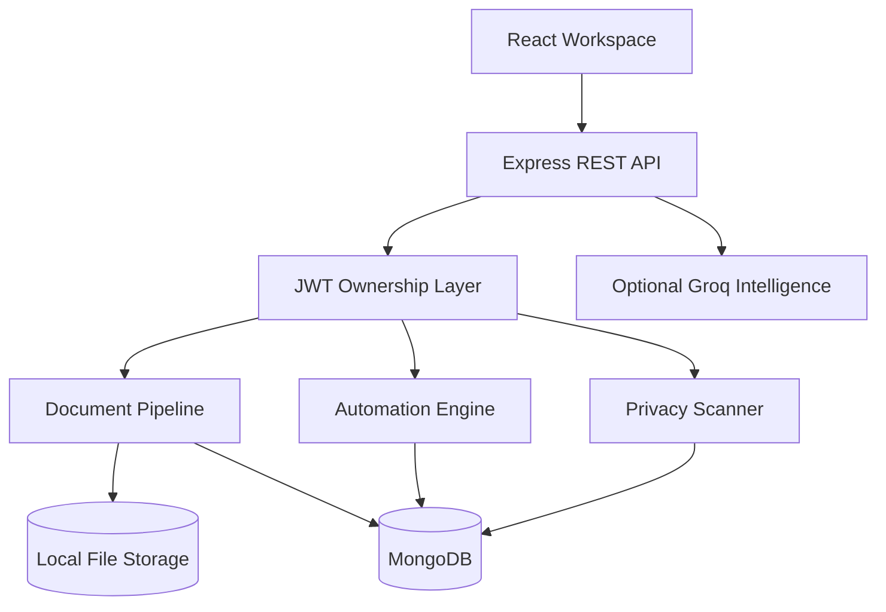

# Engineering Case Study — AutoFlow AI

## Product Problem

Document-heavy workflows often depend on manual classification, repetitive review and disconnected file storage. A basic upload portal can store a PDF, but it does not identify business priority, protect sensitive content, trigger operational actions or explain why an AI-assisted decision occurred.

AutoFlow AI was built as an end-to-end document operations platform that converts file content into secure, measurable and auditable workflows.

## Engineering Goals

- Build a responsive production-style SaaS experience.
- Keep user documents and workflow history isolated by account.
- Support local document intelligence without requiring a paid AI service.
- Add optional language intelligence without making the core workflow dependent on it.
- Keep high-impact decisions under human control.
- Preserve evidence and execution history for every automation.

## Solution Architecture



## Core Workflow

1. The authenticated user uploads a supported file.
2. Multer validates the MIME type and file size before storage.
3. PDF or TXT content is extracted where supported.
4. The local engine classifies the document, detects priority and extracts possible action items.
5. Sensitive-data patterns are scanned and masked findings are stored.
6. Active rules for the upload and detected priority are evaluated.
7. High-risk work can be routed to a human approval queue.
8. Automation results, activities and notifications are persisted.
9. The user can inspect evidence, ask grounded questions or generate a verified report.

## Important Technical Decisions

### Deterministic core with optional AI

Classification, priority detection, PII scanning and workflow evaluation run locally. Groq enhances natural-language rule creation and grounded Q&A, but an unavailable API does not stop core document processing.

### Ownership at query level

Protected document, rule, notification and audit queries include the authenticated user ID. This prevents users from retrieving another account's resource by guessing an object ID.

### Human approval for risk

High and critical priority documents can move into `review` instead of continuing automatically. The approval decision is explicit, recorded and able to trigger the next rule.

### Evidence over opaque output

Evidence Studio combines page-aware extracted content, operational insights, privacy findings and a SHA-256 file fingerprint. Page references are shown only when page indexing succeeds; the fallback does not invent a page number.

### Privacy-aware API responses

Sensitive values are detected locally and only masked samples are returned in security responses. Risk scores communicate severity without exposing the original identifier again.

## Backend Design

| Component | Responsibility |
|---|---|
| `authMiddleware` | JWT validation and authenticated user loading |
| `uploadRoutes` | File validation, extraction and pipeline orchestration |
| `documentAutomationService` | Classification, priority and action extraction |
| `automationRuleEngine` | Rule matching, actions, audit records and notifications |
| `sensitiveDataScanner` | PII detection, masking and severity calculation |
| `pdfEvidenceService` | Page-aware extraction, evidence insights and hashing |
| `groqService` | Optional grounded chat and language-to-rule parsing |
| `notificationService` | Non-blocking persistent workspace alerts |

## Frontend Design

- A shared authenticated shell provides navigation, search, notifications and profile controls.
- Feature views remain route-based and use one Axios client with a JWT interceptor.
- The command palette provides keyboard-first navigation and document search.
- Evidence Studio securely loads protected PDF data as an authenticated blob URL.
- Executive reports use print-specific CSS to produce dependency-free A4 PDF output.
- Responsive breakpoints preserve the desktop information architecture on smaller screens.

## Reliability and Safety

- Unsupported uploads are rejected before processing.
- File size limits are enforced.
- Failed notifications do not break the main automation transaction.
- Optional AI errors return clear messages while local services remain available.
- Soft deletion protects users from accidental data loss.
- Permanent deletion requires a second confirmation and removes both metadata and the stored file.
- Secrets, uploads, dependencies and build output are excluded from Git.

## Validation

```bash
cd client
npm run lint
npm run build
```

Backend JavaScript is syntax-checked independently, and critical extraction, masking and evidence helpers have deterministic validation cases.

## Outcome

The project demonstrates full-stack product engineering across authentication, file handling, document intelligence, automation, auditability, security and polished user experience. It is designed to be discussed as an engineering system rather than only as an AI interface.

## Production Roadmap

- Replace local uploads with object storage and signed URLs.
- Add OCR for scanned and image-only documents.
- Introduce team workspaces and role-based access control.
- Add vector retrieval across multiple documents.
- Containerize services and add CI/CD.
- Add automated API and browser integration tests.
